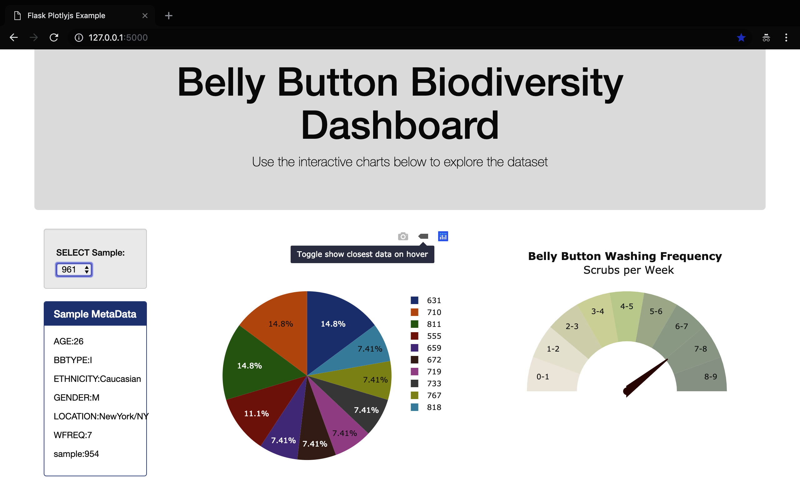

## Bacterial Analysis Dashboard

### About
This project provides users the opportunity to interact with analysis from
of thousands of bacteria samplings in a MongoDB database. Visualizations were created with D3.js. 

### Deployed on Heroku
<a href="https://tots-an-app.herokuapp.com.">Link</a>

### Frameworks
Plotly.js, D3.js, MongoDB, Python Flask and Bootstrap 4. 

### File Structure
The script in app.py (root folder) runs a server with Python Flask.
Index file in template folder.
Data in MongoDB.

### Landing Page with Dashboard

### Bubble Plot

